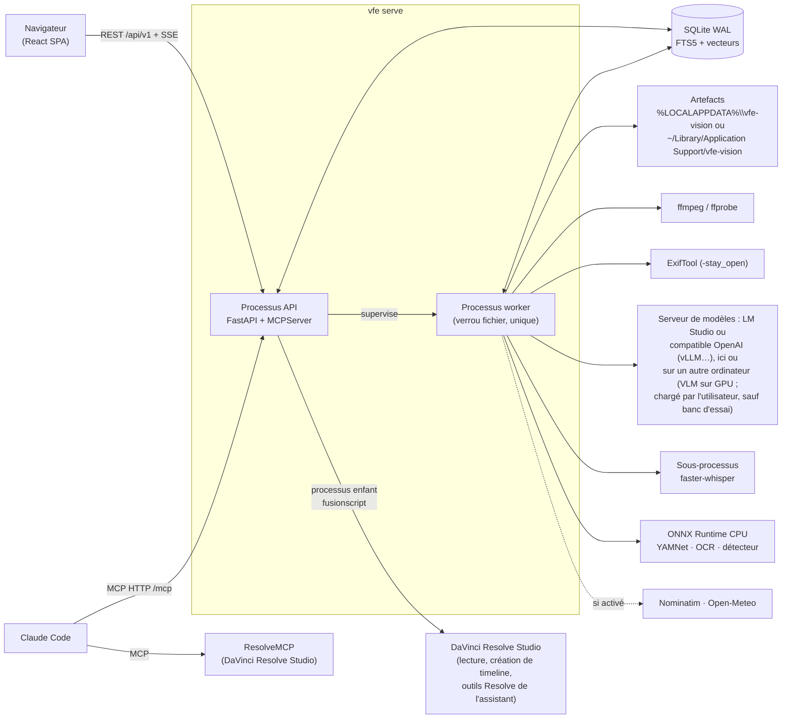

# Architecture

[English](architecture.md) · **Français**

## Vue d'ensemble

## Couches du backend

Les dépendances vont uniquement vers le bas ; `import-linter` le vérifie à chaque `just check`.

| Couche | Rôle |
|---|---|
| `cli` | commandes `vfe` |
| `api`, `mcp` | adaptateurs entrants : REST/SSE et outils MCP |
| `services` | cas d'usage partagés (bibliothèque, analyse, recherche, recadrage, exports…) |
| `jobs` | file de jobs, ordonnanceur, pools de ressources, worker, superviseur |
| `pipeline` | contrat d'étape, registre, clés de cache chaînées, étapes d'analyse |
| `adapters`, `db`, `storage` | ffmpeg, exiftool, serveur de modèles (LM Studio ou compatible OpenAI), ONNX, services web ; persistance ; artefacts |
| `ports` | interfaces à faux pour les tests (LM Studio, géocodage, météo, ASR, détecteur) |
| `domain` | logique pure : timecodes, GPS, heure de capture, soleil, couleur, boîtes, recadrage… |
| `core` | configuration, journalisation, erreurs, chemins, processus |

Windows et macOS partagent ce code : ce qui dépend du système est une branche
`sys.platform` dans l'adaptateur ou le module `core` concerné. Les processus enfants (worker,
transcription, scripts de Resolve) sont tenus par un Job Object sous Windows, par un groupe de
processus et un fil de vie ailleurs (`core/procs.py`). La langue des messages du terminal
(français ou anglais : `VFE_LANG`, sinon celle du système) est choisie par `core/language.py`,
et par les lanceurs eux-mêmes (`scripts/language.sh` sur un Mac).

## Serveur de modèles

L'adaptateur du serveur de modèles (`adapters/lmstudio`) parle à LM Studio ou à un serveur
compatible avec l'API d'OpenAI (vLLM, le serveur de llama.cpp…). Le type est dit (page Système,
`VFE_MODEL_SERVER`) ou trouvé : l'API propre de LM Studio d'abord (`GET /api/v1/models`), puis
`GET /v1/models` quand elle manque. Chaque modèle que liste un serveur compatible OpenAI est lu
comme servi, donc chargé, avec son `max_model_len` pour contexte. Le budget de tokens suit le
type : les requêtes parallèles de LM Studio se partagent un seul contexte, tandis que chaque
requête à un serveur compatible OpenAI dispose du contexte entier, le nombre envoyé à la fois
étant un réglage de ce serveur (4 par défaut). Charger et décharger un modèle n'existe qu'avec
LM Studio : le banc d'essai, qui charge les modèles un par un, a besoin de LM Studio et ne se
lance pas sur un serveur compatible OpenAI. Sur un tel serveur, la réflexion est coupée par
`chat_template_kwargs: {"enable_thinking": false}`, retiré si le serveur refuse ce champ.
