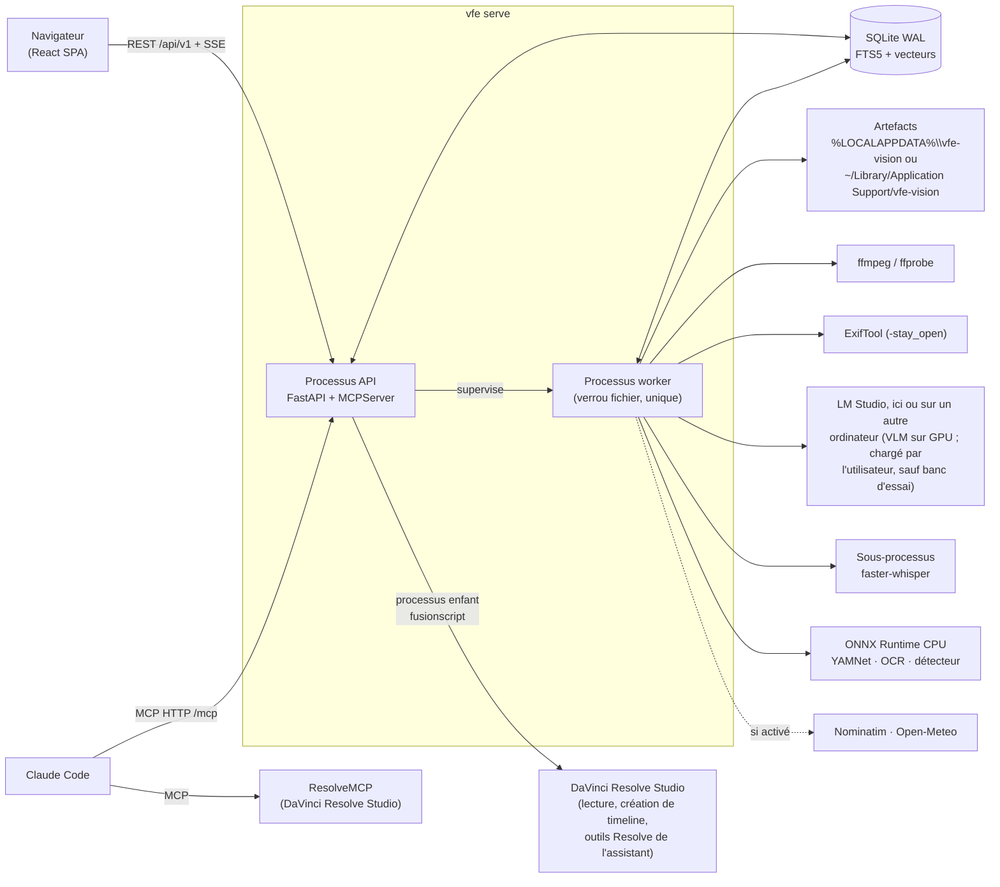

# Architecture

[English](architecture.md) · **Français**

## Vue d'ensemble

## Couches du backend

Les dépendances vont uniquement vers le bas ; `import-linter` le vérifie à chaque `just check`.

| Couche | Rôle |
|---|---|
| `cli` | commandes `vfe` |
| `api`, `mcp` | adaptateurs entrants : REST/SSE et outils MCP |
| `services` | cas d'usage partagés (bibliothèque, analyse, recherche, recadrage, exports…) |
| `jobs` | file de jobs, ordonnanceur, pools de ressources, worker, superviseur |
| `pipeline` | contrat d'étape, registre, clés de cache chaînées, étapes d'analyse |
| `adapters`, `db`, `storage` | ffmpeg, exiftool, LM Studio, ONNX, services web ; persistance ; artefacts |
| `ports` | interfaces à faux pour les tests (LM Studio, géocodage, météo, ASR, détecteur) |
| `domain` | logique pure : timecodes, GPS, heure de capture, soleil, couleur, boîtes, recadrage… |
| `core` | configuration, journalisation, erreurs, chemins, processus |

Windows et macOS partagent ce code : ce qui dépend du système est une branche
`sys.platform` dans l'adaptateur ou le module `core` concerné. Les processus enfants (worker,
transcription, scripts de Resolve) sont tenus par un Job Object sous Windows, par un groupe de
processus et un fil de vie ailleurs (`core/procs.py`).
