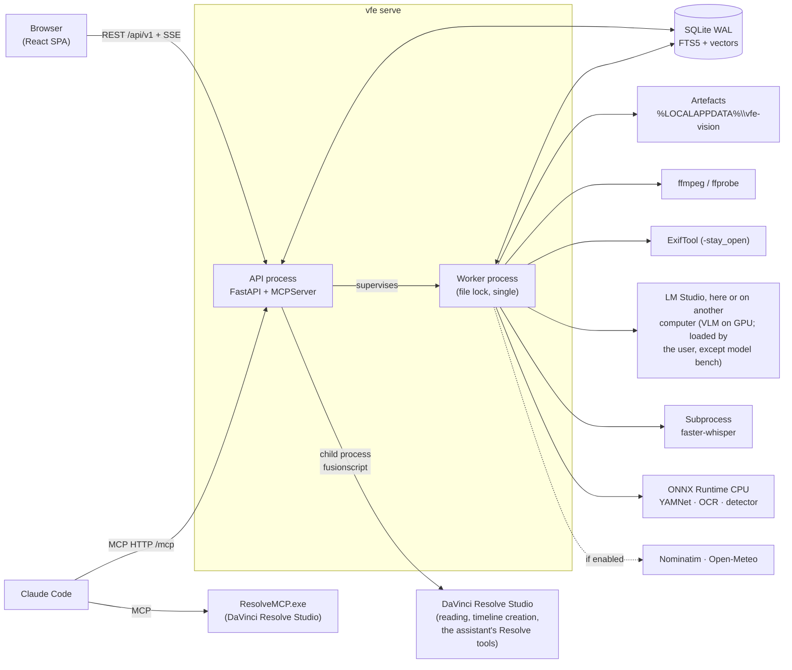

# Architecture

**English** · [Français](architecture.fr.md)

## Overview

## Backend layers

Dependencies only go downwards; `import-linter` checks this on every `just check`.

| Layer | Role |
|---|---|
| `cli` | `vfe` commands |
| `api`, `mcp` | inbound adapters: REST/SSE and MCP tools |
| `services` | shared use cases (library, analysis, search, reframing, exports…) |
| `jobs` | job queue, scheduler, resource pools, worker, supervisor |
| `pipeline` | stage contract, registry, chained cache keys, analysis stages |
| `adapters`, `db`, `storage` | ffmpeg, exiftool, LM Studio, ONNX, web services; persistence; artefacts |
| `ports` | interfaces with fakes for the tests (LM Studio, geocoding, weather, ASR, detector) |
| `domain` | pure logic: timecodes, GPS, capture time, sun, colour, boxes, reframing… |
| `core` | configuration, logging, errors, paths, processes |
