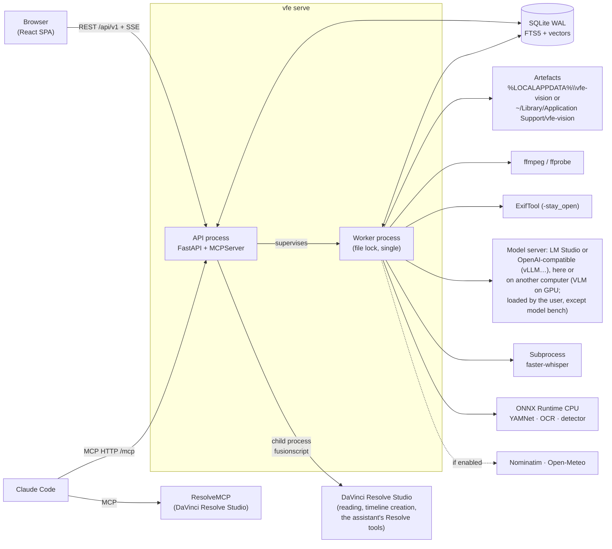

# Architecture

**English** · [Français](architecture.fr.md)

## Overview

## Backend layers

Dependencies only go downwards; `import-linter` checks this on every `just check`.

| Layer | Role |
|---|---|
| `cli` | `vfe` commands |
| `api`, `mcp` | inbound adapters: REST/SSE and MCP tools |
| `services` | shared use cases (library, analysis, search, reframing, exports…) |
| `jobs` | job queue, scheduler, resource pools, worker, supervisor |
| `pipeline` | stage contract, registry, chained cache keys, analysis stages |
| `adapters`, `db`, `storage` | ffmpeg, exiftool, model server (LM Studio or OpenAI-compatible), ONNX, web services; persistence; artefacts |
| `ports` | interfaces with fakes for the tests (LM Studio, geocoding, weather, ASR, detector) |
| `domain` | pure logic: timecodes, GPS, capture time, sun, colour, boxes, reframing… |
| `core` | configuration, logging, errors, paths, processes |

Windows and macOS share this code: what depends on the system is a `sys.platform` branch in the
adapter or `core` module concerned. The child processes (worker, transcription, Resolve's
scripts) are held by a Job Object on Windows, by a process group and a lifeline elsewhere
(`core/procs.py`). The language of the terminal's messages (French or English: `VFE_LANG`,
otherwise the system's) is chosen by `core/language.py`, and by the launchers themselves
(`scripts/language.sh` on a Mac).

## Model server

The model server adapter (`adapters/lmstudio`) speaks to LM Studio or to a server compatible with
OpenAI's API (vLLM, llama.cpp's server…). The kind is said (System page, `VFE_MODEL_SERVER`) or
found out: LM Studio's own API first (`GET /api/v1/models`), then `GET /v1/models` when it is
missing. Every model an OpenAI-compatible server lists is read as served, hence loaded, with its
`max_model_len` as context. The token budget follows the kind: LM Studio's parallel requests
share one context, while each request to an OpenAI-compatible server has the whole context, the
number sent at once being a setting of that server (4 by default). Loading and unloading a model
exist with LM Studio only: the model bench, which loads the models one by one, needs LM Studio
and does not start on an OpenAI-compatible server. On such a server, thinking is switched off
through `chat_template_kwargs: {"enable_thinking": false}`, dropped if the server refuses that
field.
