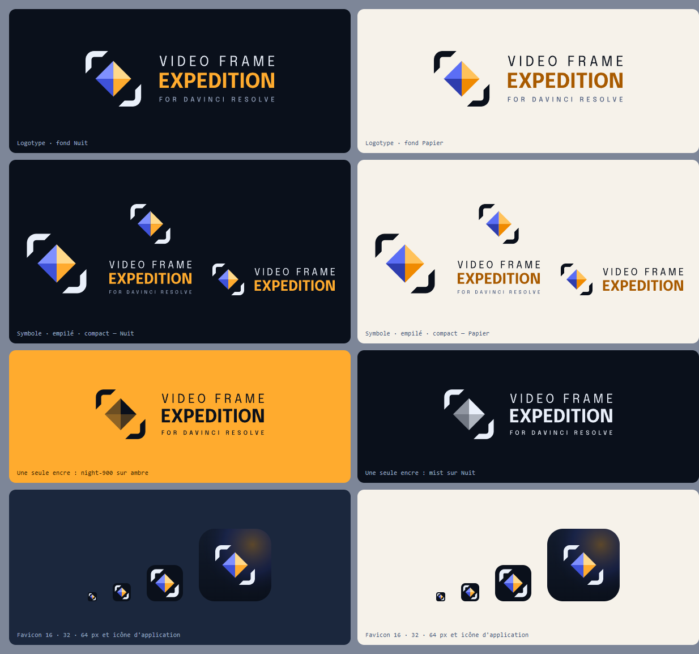

# Le logo de Video Frame Expedition for DaVinci Resolve

[English](README.md) · **Français**



Le logo est **dessiné par un programme**, pas par un outil de dessin : `build.cjs` écrit tous les
fichiers de `logo/` et de `icons/` à partir de `palette.json` (les couleurs) et de `src/lib/`
(les formes et le texte). Pour changer le logo, on change le programme, jamais un SVG à la main :
la prochaine construction écraserait la retouche.

## Le symbole : « Le Repère »

Deux **coins de visée** opposés — en haut à gauche et en bas à droite — autour d'un **losange à
quatre facettes**. Les coins sont le cadre : ce qu'on cherche dans l'image. Le losange est le
keyframe, la marque que l'on pose sur la frise d'un montage : le moment retenu.

Ses facettes sont éclairées du nord-est : les deux de droite sont **ambrées** (l'heure dorée),
les deux de gauche **bleues** (l'heure bleue) — les deux moments que l'application relève dans
chaque plan. La plus claire est en haut à droite, d'où vient la lumière.

Le cadre est ouvert, sur deux coins seulement : une expédition n'est pas terminée.

### Construction

Tout est posé sur une grille de **96 × 96**, en unités de cette grille :

| Mesure | Valeur | |
|---|---|---|
| Retrait des coins | 6 | du bord de la grille |
| Longueur des branches | 34 | chaque branche du coin |
| Épaisseur du trait | 9 | |
| Rayon de l'angle | 13 | à l'extérieur ; 4 à l'intérieur |
| Demi-diagonale du losange | 27 | centré en 48, 48 |

Les extrémités des branches sont **coupées à 45°**, dans le sens de la diagonale du losange. Le
coin du bas est le coin du haut tourné de 180°, pas une symétrie : le losange et les coins
tournent ensemble autour du même centre.

Le favicon emploie une variante plus épaisse (retrait 7, branches 38, trait 12, rayon 15,
losange 28) : à 16 px, le trait d'origine disparaît.

## Le logotype

Trois lignes de capitales, dans une seule police, **Epilogue** :

1. **VIDEO FRAME** — Epilogue 400, fine et largement espacée : elle respire ;
2. **EXPEDITION** — Epilogue 700, en ambre : le mot qui porte le nom ;
3. **FOR DAVINCI RESOLVE** — Epilogue 500, petite : la machine à laquelle l'application se
   branche.

### Le bloc est justifié

C'est ce qui tient le logotype. Les trois lignes n'ont pas la largeur que leur donnerait la
police : **chacune est étirée par son approche jusqu'à la largeur de la plus large**, c'est-à-dire
celle de « EXPEDITION ». Le bloc forme donc un rectangle exact à côté du symbole, et non un
escalier.

Chaque ligne est en outre calée sur le **bord réel de son encre**, pas sur la chasse de son
premier caractère : le V de « VIDEO », le E de « EXPEDITION » et le F de « FOR » commencent tous
au même millimètre. C'est un alignement optique, le seul que l'œil perçoit comme droit.

L'approche n'est jamais resserrée, seulement élargie : les lettres ne se touchent pas.

Le texte des fichiers SVG est **converti en courbes**. Le logo s'affiche donc partout à
l'identique, sans installer de police et sans embarquer de fichier de police.

## Les fichiers

Le fichier de référence est `logo/lockup.svg`, sur fond sombre. Chaque nom sans suffixe est la
version **Nuit** (fond sombre) ; le suffixe `-light` est la version **Papier** (fond clair).

| Fichier | Quand l'employer |
|---|---|
| `logo/lockup.svg` | Le logo complet, avec les trois lignes. Version de référence : README, documents, en-tête d'une page. |
| `logo/lockup-compact.svg` | Le nom court, sur deux lignes, quand « for DaVinci Resolve » est déjà écrit à côté ou que la place manque en hauteur. |
| `logo/lockup-ui.svg` | Le logo complet dont la troisième ligne est agrandie et moins espacée, pour rester lisible sous 56 px de haut. C'est celui de la barre latérale de l'application. |
| `logo/lockup-stacked.svg` | Le symbole au-dessus du nom centré : format carré, affiche, écran d'accueil. |
| `logo/wordmark.svg` | Le nom seul, quand le symbole est déjà présent ailleurs sur la page. |
| `logo/mark.svg` | Le symbole seul : avatar, vignette, tampon, puce. |
| `logo/lockup-mono-ink.svg`, `logo/mark-mono-ink.svg` | Une seule encre `night-900`, sur ambre ou toute couleur vive. Les facettes gardent leur relief par leur opacité. |
| `logo/lockup-mono-mist.svg`, `logo/mark-mono-mist.svg` | Une seule encre `mist`, sur fond sombre : gravure, broderie, sérigraphie. |
| `icons/favicon.svg` | Onglet du navigateur : le symbole épais sur une tuile `night-900`, dès 16 px. |
| `icons/app-icon.svg`, `icons/icon-512.png`, `icons/icon-192.png` | Icône d'application, coins arrondis, lueurs ambre et bleue. |
| `icons/app-icon-square.svg`, `icons/icon-512-maskable.png`, `icons/apple-touch-icon.png` | Les mêmes, à angles droits : c'est le système qui découpe la forme. |
| `icons/app-icon.ico` | Le raccourci du menu Démarrer de Windows : 16 à 256 px, le favicon en dessous de 32 px, l'icône d'application au-dessus. |

L'interface web reçoit ses copies au moment de la construction : `lockup-ui` et
`lockup-compact` dans `frontend/src/assets/brand/` (les deux thèmes), et le favicon dans
`frontend/public/`. Ne pas les modifier là : elles sont réécrites.

## Les règles

- **Zone de protection** : laisser autour du logo un vide égal au **quart de la hauteur du
  symbole**. Aucun texte, aucun bord d'image, aucune autre marque n'y entre.
- **Tailles minimales** : symbole seul, **16 px** ; `lockup-ui`, **32 px** de haut ;
  `lockup` complet, **200 px** de large (40 mm à l'impression). Sous 56 px de haut, prendre
  `lockup-ui` et non `lockup`.
- **Sur une photo** : poser d'abord un voile sombre (`#0a101bcc`), puis la version Nuit.
- **Ne pas** : pivoter, incliner, étirer, écraser, changer les couleurs, ajouter une ombre, un
  contour ou une lueur, refermer le cadre sur quatre coins, recomposer le nom dans une autre
  police ou avec une autre approche, ni séparer le symbole du texte à l'intérieur d'un même
  verrouillage.

## Les couleurs

Elles sont décrites une à une, avec leur emploi, dans **`palette.json`**. En résumé :

| Rôle | Nuit | Papier |
|---|---|---|
| Fond | `night-900` `#0a101b` | `paper` `#f6f2ea` |
| « VIDEO FRAME » et coins de visée | `mist` `#eaf0fa` | `night-900` `#0a101b` |
| « EXPEDITION » | `gold-500` `#ffab2e` | `gold-700` `#a85a00` |
| « FOR DAVINCI RESOLVE » | `night-300` `#98a7c2` | `night-500` `#46577a` |
| Facettes ambrées du losange | `gold-300`, `gold-500` | `gold-400`, `gold-600` |
| Facettes bleues du losange | `blue-400`, `blue-600` | `blue-500`, `blue-700` |

La construction **échoue** si un contraste tombe sous le seuil : 4,5:1 pour chaque ligne de texte
sur son fond, 3:1 pour les coins de visée et pour chaque facette sur la tuile de l'icône. Le plus
faible aujourd'hui est de 3,1:1 (la facette `blue-600` sur `night-900`, un aplat décoratif).

## Reconstruire

```sh
cd docs/brand
npm install --no-save opentype.js   # une fois : sert à convertir le texte en courbes
node build.cjs                      # les SVG de logo/ et icons/, et les copies de l'interface
node render-png.mjs                 # les PNG des icônes, app-icon.ico et apercu.png (Microsoft Edge)
```

`build.cjs` télécharge au premier passage les trois graisses d'Epilogue dans `.cache/fonts`
(non versionné).
`render-png.mjs` emprunte le Playwright du dossier `frontend` et le Microsoft Edge du système.

## La police

Une seule : **[Epilogue](https://github.com/etunni/epilogue)** (Etienne Aubert Bonn, Tunera Type
Foundry), en trois graisses — 400, 500 et 700. Elle est sous **SIL Open Font License 1.1**, qui
autorise la conversion en courbes du logotype, et elle est prise dans le paquet
[`@fontsource/epilogue`](https://fontsource.org/fonts/epilogue).

Une police unique, pas trois : le logotype tient par la structure du bloc et par le contraste des
graisses, pas par le mélange des caractères.

## Mentions

« DaVinci Resolve » et « Blackmagic Design » sont des marques de Blackmagic Design Pty Ltd. Ce
logo est celui d'une application indépendante, qui n'est ni éditée, ni approuvée, ni soutenue par
Blackmagic Design.
